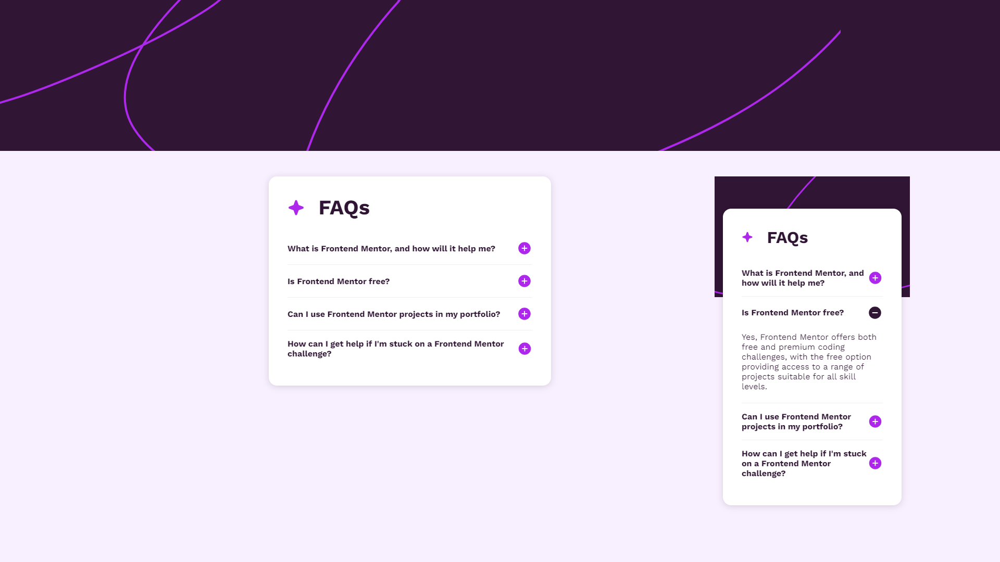

# Frontend Mentor - FAQ accordion solution

This is a solution to the [FAQ accordion challenge on Frontend Mentor](https://www.frontendmentor.io/challenges/faq-accordion-wyfFdeBwBz). Frontend Mentor challenges help you improve your coding skills by building realistic projects.

## Table of contents

- [Overview](#overview)
    - [The challenge](#the-challenge)
    - [Screenshot](#screenshot)
    - [Links](#links)
- [My process](#my-process)
    - [Built with](#built-with)
    - [What I learned](#what-i-learned)
- [Author](#author)

**Note: Delete this note and update the table of contents based on what sections you keep.**

## Overview

### The challenge

Users should be able to:

- Hide/Show the answer to a question when the question is clicked
- Navigate the questions and hide/show answers using keyboard navigation alone
- View the optimal layout for the interface depending on their device's screen size
- See hover and focus states for all interactive elements on the page

### Screenshot

### Links

- Solution URL: [https://github.com/grzeg95/faq-accordion/](https://github.com/grzeg95/faq-accordion/)
- Live Site URL: [https://faq-accordion-f7511.web.app/](https://faq-accordion-f7511.web.app/)

## My process

### Built with

- Firebase hosting:github
- [Angular 17](https://angular.dev/)
- SASS
- CSS BEM
- Mobile-first workflow

### What I learned

- Angular CDK Dialogs
- Angular CDK Accordion
- Angular CDK Portal

## Author

- Frontend Mentor - [@grzeg95](https://www.frontendmentor.io/profile/grzeg95)
